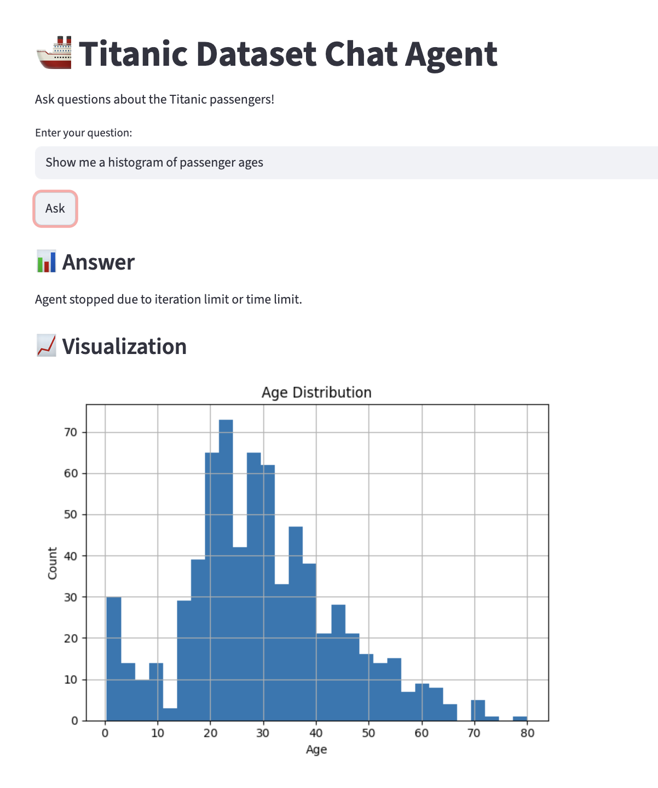

# Titanic Data Chatbot (LangChain + FastAPI + Streamlit)

An AI-powered chatbot that answers natural language questions about the Titanic dataset and generates visualizations automatically.

## Features

- Ask questions in plain English  
- Performs real-time data analysis using Pandas  
- Generates charts dynamically  
- Built using LangChain agent  
- REST API powered by FastAPI  
- Interactive UI using Streamlit  

---

## Tech Stack

- FastAPI
- LangChain
- Groq LLM
- Pandas
- Matplotlib
- Streamlit
- Render (Backend Deployment)
- Streamlit Cloud (Frontend Deployment)

---

## Live Demo

Frontend:  
https://your-app-name.streamlit.app  

Backend:  
https://titanic-chatbot-n2id.onrender.com  

---

## Example Questions

- How many passengers survived?
- Show survival rate by gender
- Plot age distribution
- What is the average fare?

---

## How It Works

1. User enters a question in the Streamlit UI  
2. Request is sent to the FastAPI backend  
3. LangChain Pandas Agent processes the dataset  
4. Response and plot are returned to the UI  

---

## Demo

